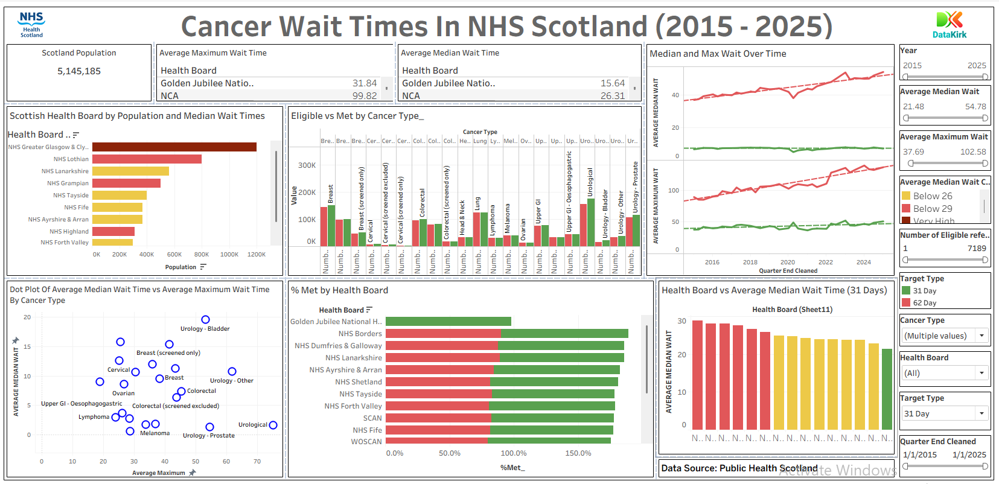

# Cancer Waiting Times in NHS Scotland (2015–2025): An Interactive Dashboard and Data Storytelling Project
Tableau dashboard analyzing NHS Scotland cancer treatment wait times (2015-2025)

**Title:** [Cancer Wait Times in NHS Scotland (2015–2025): A Tableau Data Storytelling Project](https://github.com/Osiwi/NHS-SCOTLAND-CANCER-WAIT-TIMES-2015-2025-DASHBOARD/blob/main/Data_Visualisation_and_Storytelling_DataKirk_update.twb)

**Tools & Technologies Used:** Tableau: Data visualization and dashboard development
                               Microsoft Excel: Data cleaning and preprocessing
                               OCR (Tesseract via Python): Extracted data labels for validation (optional preprocessing step)
                               Microsoft Word: Report preparation
                               Public Health Scotland Dataset: Cancer Waiting Times (CWT) 2015–2025
                               
**Project Description Overview:** This project presents a comprehensive analysis and interactive dashboard of NHS Scotland's cancer waiting times using real-world data from Public Health Scotland. By visualizing compliance with the 31-day and 62-day treatment standards, the project uncovers critical delays, geographical inequalities, cancer-type disparities, identification and visualization variations in performance across health boards and cancer types while offering actionable insights for policymakers and healthcare strategists.

**Objective:** To evaluate and communicate the performance of Scotland’s NHS Health Boards against national cancer treatment standards (62-day and 31-day targets) between 2015 and 2025 using an interactive dashboard and data storytelling narrative. The aim is to inform decision-making, promote transparency, and support evidence-based health reforms.

**Key Features Included in the Dashboard:** Trend Line Charts for 31-day and 62-day standard performance across time
                                            Max and Median Wait Time Charts by cancer type
                                            Performance by Cancer Type split across 31-day and 62-day targets
                                            Met vs Not Met Performance across Health Boards
                                            Population vs Staffing Ratios and Impact on Wait Times
                                            Map Visualization of health board performance and geographical disparities
                                            Dot Plot of Wait Distributions by Cancer Type
                                            Summary Indicators for total population, median and max wait times
                                            
**Interactive Slicers and Filters:** Quarter/Date Range Slider (from 2015 to 2025)
                                     Health Board Filter
                                     Cancer Type Filters (Prostate, Breast, Colorectal, Lung)
                                     Target Type Filters (31-Day vs 62-Day)
                                     Measure Filter: Compare population vs staff capacity
                                     Population and Wait Time Threshold Controls
                                     Dynamic Legends for selected performance metrics

**Key findings:** Deterioration in 62-Day Target Compliance: The National compliance with the 62-day referral-to-treatment standard declined sharply after 2017—dropping from above 95% to 68% during the pandemic in 2021, with only marginal recovery (~68%) by 2025.
Stable 31-Day Target Performance: In contrast, the 31-day decision-to-treatment standard remained consistently met across most cancer types (>95%) throughout the 2015–2025 period.
Persistent Diagnostic Delays: Urological and colorectal cancer pathways exhibited the longest wait times, with maximum delays exceeding 120 days. These delays were primarily due to diagnostic bottlenecks rather than treatment backlogs.
Health Board Disparities: Larger, urban health boards (e.g., NHS Greater Glasgow and Clyde, Lothian, and Grampian) experienced the highest delays—linked to greater patient volumes and under-resourced diagnostic infrastructure.
Postcode Inequality Evident: Smaller, remote health boards such as NHS Western Isles, Orkney, and Shetland consistently outperformed larger boards in meeting the 62-day target, highlighting regional inequities in service delivery.
Low Compliance in Specific Cancer Types: Prostate, colorectal, and cervical cancers recorded the poorest performance under the 62-day standard, further reinforcing the link between diagnostic complexity and delay.
Systemic Resource Constraints: The most significant contributors to missed targets were diagnostic and workforce limitations and not merely pandemic disruptions thereby indicating the need for structural reforms.

**Dashboard Overview:**

